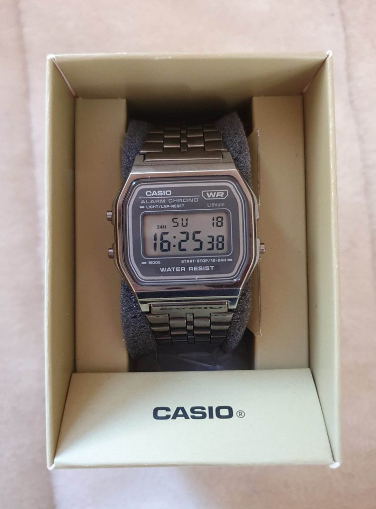
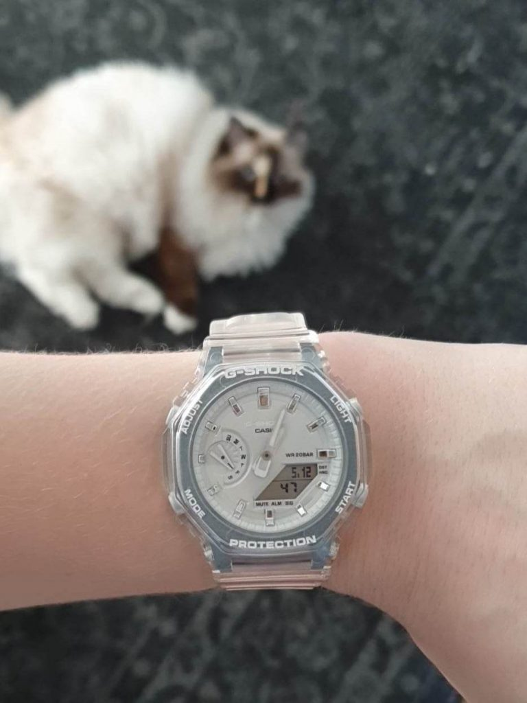

I vintras fastnade jag för en ny klädbutik. Blue Tomato. Jag gillar typ hela deras utbud. Kanske inte ALLT, och jag tror ju absolut inte att jag PASSAR i allt. Men mycket av det kan jag ändå uppskatta. En av dessa saker, som har etsat sig fast i min hjärna, är en klocka.

[G-SHOCK DW-5610DN-9ER](https://www.blue-tomato.com/sv-SE/product/G+SHOCK-DW+5610DN+9ER+Klocka-632414/?varid=304384693), eller som butikspersonalen refererar till den, legoklockan. En klassisk digital G-Shock med en stor skillnad. Färgen. Istället för svart är den: röd, gul, grön, orange, lila och ljusblå. Med en digital display av svart på vitt. Man kan lätt förstå var namnet 'legoklockan' har sitt ursprung, då det ser ut som om någon har byggt ihop den av färgglada bitar.

Vad som gör den speciell i mina ögon är just att det är en G-Shock. Om det var en lite mindre, fortfarande lika plastig klocka, av ett annat märke, hade den nog bara känts barnslig. Men nu är det en stötsäker klocka som klarar ett djup på 200m, trots sitt barnsliga utseende. Har man en sportig 90-tals vibe så kan man lätt klara av att bära upp den, utan att det ser ut som om man lät ens barn välja vilken klocka man skulle ha.

Detta kunde dock inte bli min första klocka, då den passar med ett, kanske två, klädesplagg jag äger. Så till och börja med skaffade jag en [CASIO A158WETB-1AEF](https://www.blue-tomato.com/sv-SE/product/Casio-A158WETB+1AEF+Klocka-687873/?varid=304854394). Bara för att se om jag överhuvudtaget skulle använda en klocka om jag hade en.

<figure>

<figcaption>

Casion i sin låda

</figcaption>

</figure>

När det var etablerat, köpte jag mig en [G-SHOCK GMA-S2100SK-7AER](https://www.ditur.se/casio-g-shock-gma-s2100sk-7aer). En vit genomskinlig casioak, (i lite mindre modell, för mina små handleder) som passar de flesta av mina outfits. Och gör den inte det, så har jag ju alltid min Casio. Men jag ska inte ljuga, jag har sett [GM-S110-1AER](https://www.ditur.com/casio-g-shock-5706-gm-s110-1aer) på min arm och den sitter som en smäck! Och vem vet, när man väl har några staples, kanske man kan börja kolla efter legoklockan igen ;)

<figure>

<figcaption>

Min vita genomskinliga G-Shock

</figcaption>

</figure>
