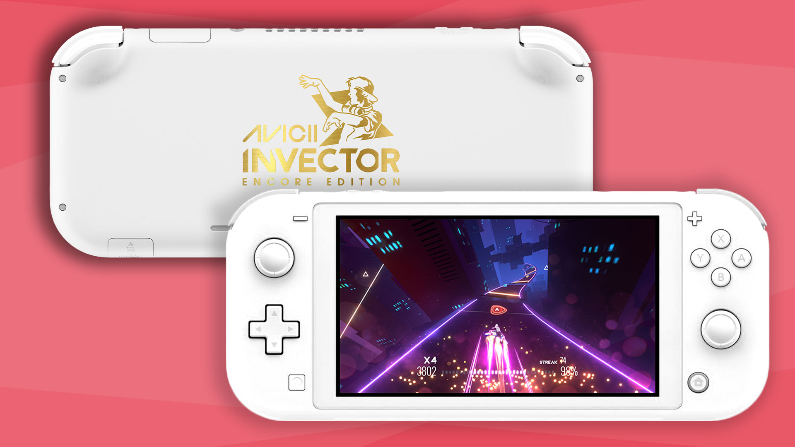

Nintendo has done a lot of custom coloured Switches, especially of the standard Switch. The 'lite' version though, mostly has some basic recolours. And a couple of Pokémon variants. But there is one Switch Lite that stands out of the crew. The white, custom gold painted Avicii Invector Switch Lite.

2017 [Hello There Games](https://hellotheregames.com/) released '[Invector](https://www.youtube.com/watch?v=3oWAqf5ckvU)' on the PS4. A rhythm based music game with 22 of Aviciis hit songs. In 2019, the year after his tragic passing, they released an updated version with 35 songs, in collaboration with the [Tim Bergling Foundation](https://www.timberglingfoundation.org/). [Avicii Invector: Encore Edition](https://www.nintendo.com/store/products/avicii-invector-encore-edition-switch/), and with the release, there was a charity auction, where all the money gathered went to the mental health organisation, [Safe In Our World](https://safeinourworld.org/). This is where the rare Switch Lite enters the stage. Five beautiful custom painted switches were auctioned out. And what makes them extra special is that they're actually licensed by Nintendo. Many companies has had lotteries or the like with custom painted or shells swapped switches, but this is actually a fully legit licensed Nintendo Switch Lite, and it. Is. Beautiful!

